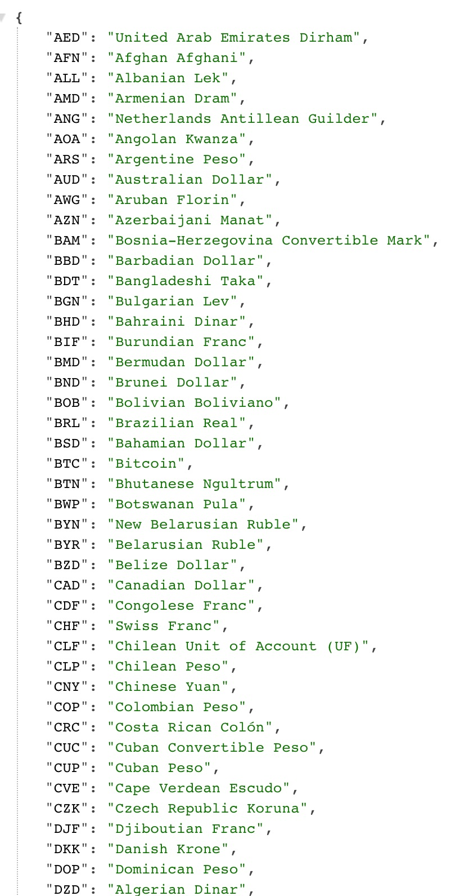

# Foreign Exchange Calculator
The demo project provides an API for a ForEx widget that accepts 2 different currencies and exchanges them to the corresponding buying or selling rate depending on the given input. The exchange rates are provided via external API provided by https://exchangeratesapi.io/ (Although there are some constraints that will be explained later regarding the free trial version).

### Requirements

-   Java JDK 8
-   Maven
-   Any IDE that can run Spring Boot 2.x.x (IntelliJ, Eclipse, VSC)

### Assumptions and Considerations

1.  The external API only supports EUR (Euro) as their base currency that gives out 168 different conversions given the EUR value. In the codebase, the software derives the buy currency value from the EUR value like so:

    -   CUR = any given *buy* currency

    -   1 EUR = x `B_CUR` (e.g. 1 EUR = 1.2 USD)
    -   `B_CUR` = 1 (EUR) / x (e.g. 1 USD = 0.83 EUR)
    -   `B_CUR` = `S_CUR` (e.g. 1 / 0.83 USD = 58.8 PHP which means 1 USD = 48.8 USD)

2.  Since all the necessary values needed are provided in the API, the software does not include Hibernate, JPA, and any database configurations (MVP). Should there be anything the software needs to store, these configurations can be re-enabled and a database can be made.

3.  The code consists of a single model, a single controller, and a single service that does all the operations given in the specifications.

4.  The model is a multi-purpose Data Transfer Object (DTO) that catches the results of 2 different endpoints from the external API.

    1.  `/symbols` - This endpoint retrieves a map of all the currencies. It returns a key-value pair of the currency acronym (EUR) and its' corresponding value (Euro)
    2.  `/latest` - This endpoint retrieves a map of the conversion rates given the following request parameters:
        -   `base` - The base currency to convert into another currency
        -   `symbols` - The currencies to convert the `base` currency into (If there is no `symbols` param specified, it will return the conversion rates of 168 currencies)

### User Stories

1.  As a user, I need to know how much I will be paying in Currency 1 when buying Currency 2.
2.  As a user, I need to know how much I will receive in Currency 1 when selling Currency 2.

## How to Run the Project

1.  Clone the project from the Github repository in your desired directory (https://github.com/rayvenesplanada/offshoreteam):

    ```terminal
    git clone https://github.com/rayvenesplanada/offshoreteam.git
    ```

2.  Import the project in your IDE and run the following commands 

    1.  Run `mvn compile` in the terminal in the project root directory to compile the project.

    2.  `mvn clean install` to follow up the compilation and run the tests.

    3.  Run the project by right clicking the main application class `MartrustApplication` and clicking `Run`.

    4.  Once the application has ran successfully, go to your preferred browser and check if the `/symbols` endpoint is working by putting in `http://localhost:8080/api/v1/currency_exchange` in the address bar  this is the `GET` endpoint to retrieve the map of the currency acronyms to their values.

        You will be greeted with something a map of 168 currencies:

        

        

    5.  For the actual endpoint that does the conversion, open up the Swagger UI using this URL:

        `http://localhost:8080/api/swagger-ui.html`

    6.  Click the `/v1/currency_exchange/convert` endpoint and click `Try It Out`

    7.  There are 2 cases to cover for this endpoint: the sell rate and the buy rate given the other.

        #### **Looking for the Sell Rate**

        1.  For the sell rate, fill up the request body with something like this:

            ```json
            {
                "buyCurrency": "USD",
                "buyAmount": 12.0,
                "sellCurrency": "PHP"
            }
            ```

            You don't need to fill up the `sellAmount` since it will return the value of this field after you run the code.

        2.  Click `Execute`. If the request is successful, it will return a `200` status code and a Request Body that looks like this:

            ```json
            {
              "success": true,
              "symbols": null,
              "rates": null,
              "buyCurrency": "USD",
              "buyAmount": 12,
              "sellCurrency": "PHP",
              "sellAmount": 580.6078206022004,
              "baseConversionAmount": 48.38398505018336
            }
            ```

            **Note:** `baseConversionAmount` is the amount of the *sell* currency given the *buy currency* (e.g. 1 USD = 48.38 PHP)

        #### **Looking for the Buy Rate**

        1.  To look for the buy rate, fill up the request body with something like this:

            ```json
            {
                "buyCurrency": "USD",
                "sellCurrency": "PHP",
                "sellAmount": 5000.0
            }
            ```

        2.  Click `Execute`. If the request is successful, it will return a `200` status code and a Request Body that looks like this:

            ```json
            {
              "success": true,
              "symbols": null,
              "rates": null,
              "buyCurrency": "USD",
              "buyAmount": 241919.9252509168,
              "sellCurrency": "PHP",
              "sellAmount": 5000,
              "baseConversionAmount": 0.020667995804041574
            }
            ```

            For context, this means that if you want to sell `5000` PHP to convert to USD, you would get `103.34` USD in return.

### Unit Tests

For this project, only the service layer is covered 100% in the unit tests. Covering the controller with unit tests would be redundant since the two controllers only have 1 line inside of them and both are calls to the service layer.

